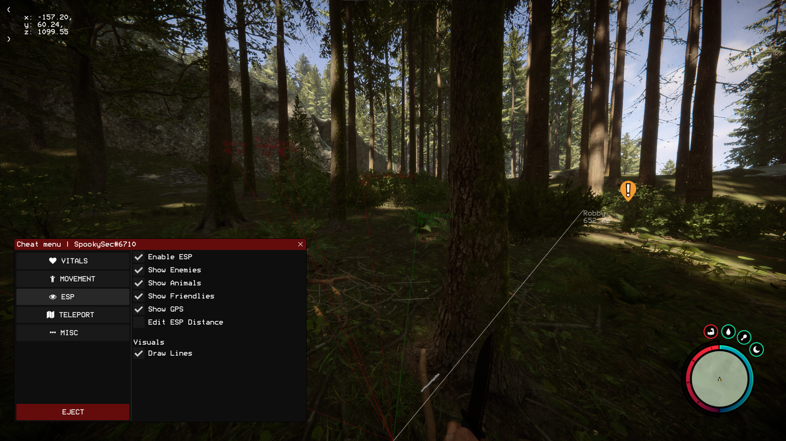
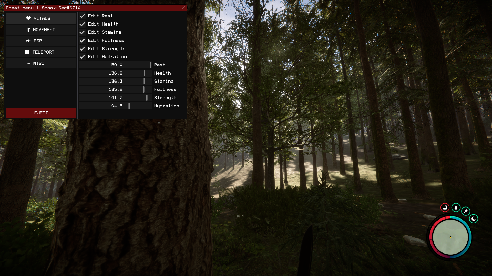
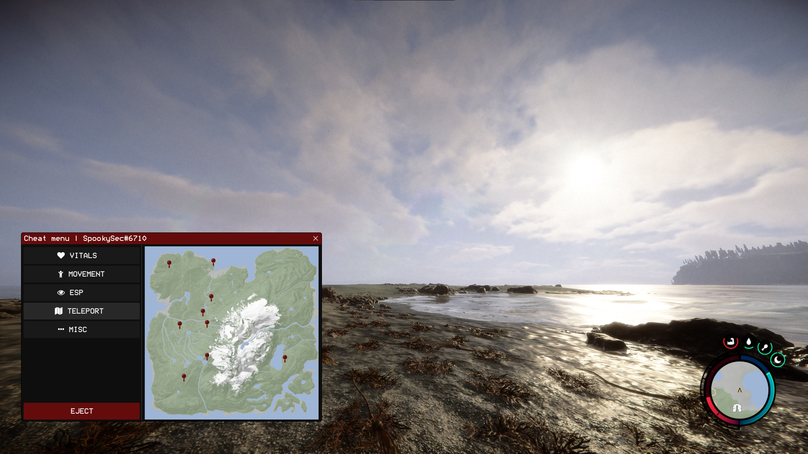

# A Sons of the forest internal C++ cheat

## Features
Current features are as seen in `config.h`:

```c++
namespace Config
{
    inline bool bHealth = false;
    inline bool bStamina = false;
    inline bool bFullness = false;
    inline bool bRest = false;
    inline bool bStrength = false;
    inline bool bHydration = false;
    inline bool bInvisible = false;
    inline bool bSpeed = false;
    inline bool bJump = false;
    inline bool bFallDamage = false;

    namespace Value
    {
        inline float health = 50.f;
        inline float stamina = 50.f;
        inline float fullness = 50.f;
        inline float rest = 50.f;
        inline float strength = 50.f;
        inline float hydration = 50.f;

        inline float jumpHeight = 2.6f;
        inline float runSpeed = 5.4f;
        inline float swimSpeedMultiplier = 1.f;
    }
}
```

## TODO
- [ ] Add ESP

## Compiling
Honestly if you don't know how to compile a C++ project, then maybe you shouldn't be here.

Open the .sln file in Visual Studio, Ctrl + Shift + B to compile solution, find the produced DLL under `SonsOfTheForestInternal/build/SonsOfTheForestInternal.dll`

Use any injector, the game has no anti cheat so even Process Hacker's DLL injector should work fine.

## Precompiled DLL
A compiled DLL can be found under `build/` in this repo, statically compiled so injection should be smooth.

## Screenshots
### ESP with distance, name, type, lines, and GPS coords.


--- 
### Edit vitals in memory such as health, stamina, hunger, rest etc...


---
### A never seen before image of the map with clickable pins to teleport you to interesting landmarks!

